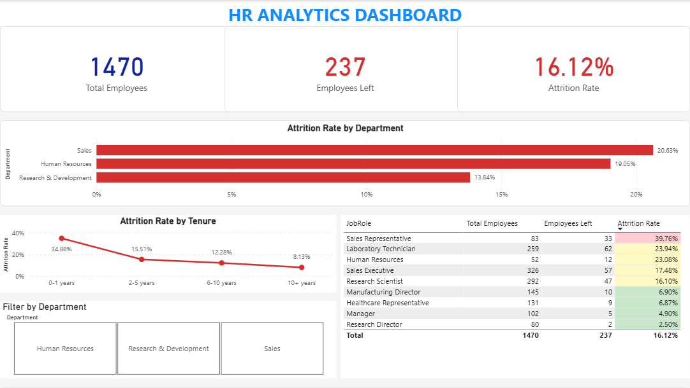
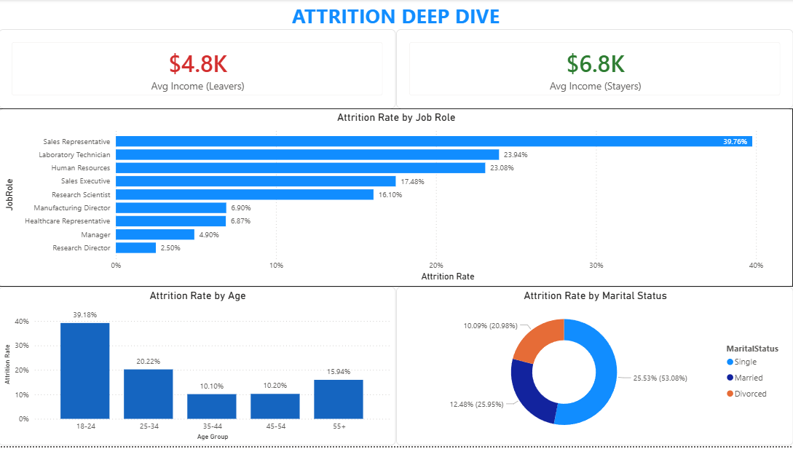
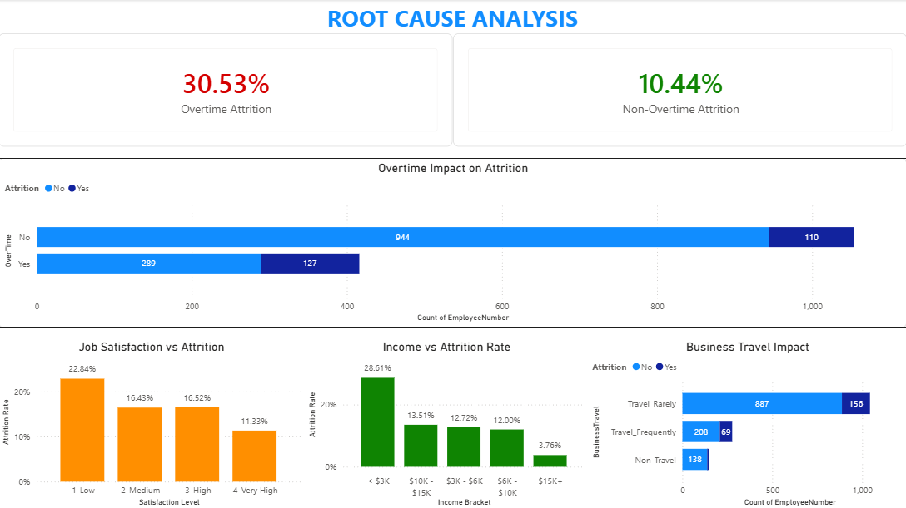
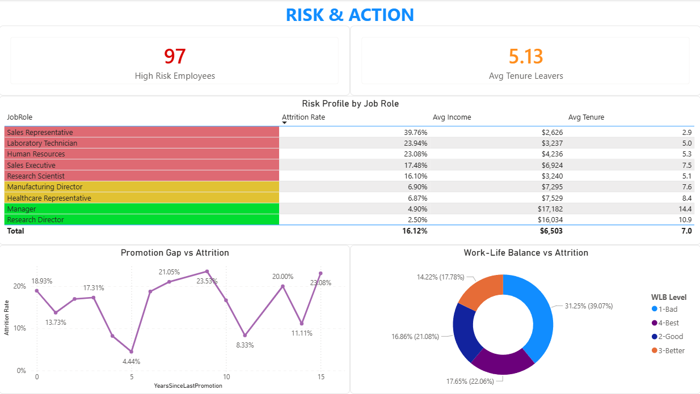

# HR Analytics - Employee Attrition Analysis

## Project Overview
This project analyzes employee attrition patterns using the IBM HR Analytics dataset (1,470 employees). The goal is to identify which employees are most likely to resign and what factors drive that decision, then translate those findings into a Power BI dashboard that HR teams can actually use.

## Business Questions
1. What is the overall attrition rate, and how does it compare to industry benchmarks?
2. Which departments and job roles have the highest turnover?
3. Is there a relationship between job satisfaction, overtime, and resignation?
4. What combination of factors puts an employee at highest risk of leaving?
5. Can we build a simple risk score to flag at-risk employees before they resign?

## Key Findings
- **Attrition rate: 16.12%**, above the 10-15% industry average
- **Sales Representatives** have the highest attrition at 39.76%, nearly 4 in 10 leave
- Employees who work **overtime** are 3x more likely to resign (30.5% vs 10.4%)
- Those who left earned **$2,045 less per month** on average than those who stayed
- **New hires (0-1 years)** have a 34.88% attrition rate, pointing to an onboarding gap
- **Single employees** and those with **poor work-life balance** are significantly more likely to leave

## Tools Used
- **Excel** for initial data inspection and validation
- **PostgreSQL** for data cleaning, exploration, and analysis
- **Power BI** for the interactive 4-page dashboard with DAX measures

## Project Structure
```
hr-analytics-project/
├── sql/
│   ├── 01_create_table.sql      # Table schema for the dataset
│   ├── 02_data_exploration.sql   # Data quality checks and profiling
│   └── 03_analysis.sql          # Full analysis (7 sections, 15+ queries)
├── docs/
│   └── key_insights.md          # Summary of findings and recommendations
├── powerbi/
│   └── hr_analytics_dashboard.pbix  # Interactive dashboard (4 pages)
├── excel/
│   └── hr_data_original.xlsx    # Original dataset
└── screenshots/                 # Dashboard screenshots
```

## Dashboard Preview

### Page 1: Executive Summary


### Page 2: Attrition Deep Dive


### Page 3: Root Cause Analysis


### Page 4: Risk & Action


## Dataset
[IBM HR Analytics Employee Attrition & Performance](https://www.kaggle.com/datasets/pavansubhasht/ibm-hr-analytics-attrition-dataset) (1,470 rows, 35 columns)

---
*Project by: mwijiam*
